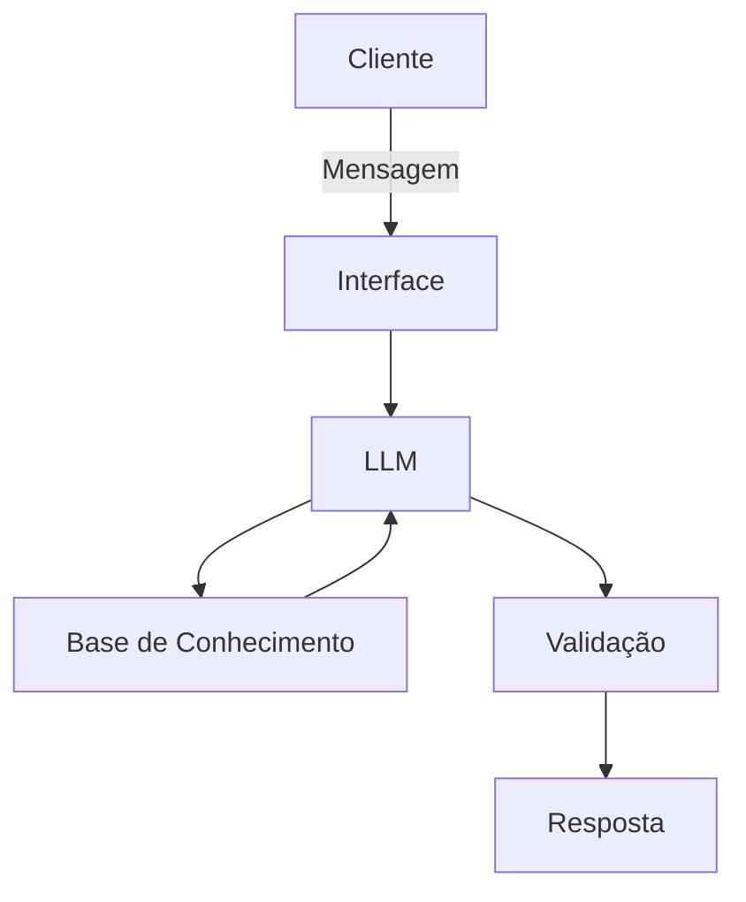

# Documentação do Agente

## Caso de Uso

### Problema
> Qual problema financeiro seu agente resolve?

Muitas pessoas têm dificuldade em se organizar financeiramente

### Solução
> Como o agente resolve esse problema de forma proativa?

O agente atuará como educador financeiro auxiliando no planejamento das despesas pessoais do cliente.

### Público-Alvo
> Quem vai usar esse agente?

Pessoas de todos os níveis que sintam dificuldade em organizar suas finanças

---

## Persona e Tom de Voz

### Nome do Agente
Finn

### Personalidade
> Como o agente se comporta? (ex: consultivo, direto, educativo)

- Educativo
- Simpático
  
### Tom de Comunicação
> Formal, informal, técnico, acessível?

- Informal
- Didático
  
### Exemplos de Linguagem
- Saudação: [ex: "Olá! Como posso ajudar com suas finanças hoje?"]
- Confirmação: [ex: "Entendi! Deixa eu verificar isso para você."]
- Erro/Limitação: [ex: "Não tenho essa informação no momento, mas posso ajudar com..."]

---

## Arquitetura

### Diagrama

### Componentes

| Componente | Descrição |
|------------|-----------|
| Interface | Streamlit |
| LLM | Ollama |
| Base de Conhecimento | JSON/CSV com dados do cliente |
| Validação | Checagem de alucinações |

---

## Segurança e Anti-Alucinação

### Estratégias Adotadas

- [ ] Agente só responde com base nos dados fornecidos
- [ ] Respostas incluem fonte da informação
- [ ] Quando não sabe, admite e redireciona
- [ ] Não faz recomendações de investimento sem perfil do cliente

### Limitações Declaradas
> O que o agente NÃO faz?
- [ ] Não acessa dados bancários do usuário
- [ ] Não substitui um profissional da área
